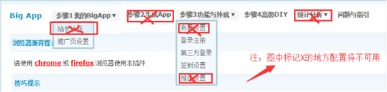

# V1.0.3 更新说明
##增加了网页推送启动页的功能
	接受了rex指派的任务（"https://coding.net/u/Click_04/p/bigapp_ios/task/458144"）增加了网页推送启动页的功能，只需要修改位于纸飞机的网页（"http://my.nuaa.edu.cn/forum_static/myapp/splash.png"）即可修改启动页推送图。

纸飞机南航青年网络社区

2016.4.5 monkeyclue@163.com

# V1.0.2 更新说明
##增加了cocoapod包管理方式
	增加了cocoapod包管理方式，更加方便地管理各种库。目前只用其管理QBImagePickerController
##优化了相册的显示问题
	通过最新版(3.4.0)的QBImagePickerController，优化了相册照片的起始位置。起始位置改为了最底部（即最新拍摄的照片）
	
	本次优化得益于PM的指教，在插入QBImagePickerController库后修改了回调函数，修改方式在PostSendViewController.m中，原代码已被注释。
	
	另外，增加了“imagePickerController.showsNumberOfSelectedAssets = YES;//显示选择的图片张数”的语句，方便查看。后期可改为NO即可关闭此功能。

纸飞机南航青年网络社区

2016.4.5  monkeyclue@163.com
	
# V1.0.1 更新说明

##优化掉了部分功能
	去掉了站内信tab内顶部的四个按钮,因为没有对应的接口（1001、1002、1003、1004）
	
    monkey在messageVC.m中注释掉了相关代码，并对UI进行了一部分更改。
    
    所有更改都有注释，以便在今后增加这四个接口后能迅速修改代码。

##修改了“关于我们”的显示方式

    AboutViewControllert.m里，自动调用version改成了直接打印数字,主要考虑到version值会被后台插件调用来验证插件版本和bigapp版本是否对应。

    因此关于我们的版本号是指纸飞机自身的版本号。并且增加了一些信息，如更新时间、iOS支持邮箱等。

纸飞机南航青年网络社区

2016.4.2  monkeyclue@163.com

# 开源目的

通过使用该源码，开发者可以迅速地将Discuz论坛迁移到iOS客户端中。不需要任何的开发工作即可拥有属于自己论坛的iOS客户端。

# 准备工作

在使用源码之前必须先在Discuz论坛中安装BigApp插件。

#### 一、插件安装

应用中心 -> 插件 -> 搜索bigapp -> 点击BigApp手机客户端 -> 安装应用即可

安装步骤参考 [Bigapp安装方法](http://addon.discuz.com/?@bigapp.plugin.doc/install_step)

#### 二、配置插件

1、登录注册模式（原生登录、web登录、原生注册、web注册、允许客户端更换头像）

2、第三方登录开关（QQ登录、微信登录开关）

3、签到设置（APP签到设置）

4、高级DIY设置如下（APP设计器、样式设置）, 如图：

> 注：如下配置将不可用（站长认证、生成App、布局设置、推送设置、统计分析）, 如图：
> 

# 使用说明

1、使用XCode打开Clan.xcodeproj项目文件。

2、在XCode左侧的文件列表中找到ThemeStyle.plist文件（路径：Clan/Application/ThemeStyle.plist）。

3、对Plist文件中的字段进行配置，其中配置项说明如下表所示：

|名称|说明|
|--------------------|-------------------------|
|YZBaseURL|论坛地址|
|YZBasePath|插件接口的路径，固定为：api/mobile/iyz_index.php|
|APPSTYLE|应用样式。 1.tab风格， 2.侧边栏风格|
|YZSegMent|主题颜色|
|YZBBSName|论坛名称，作为某些页面的视图标题（如首页）以及分享时的出处。|
|kAPP_DOWNLOAD_URL|应用下载地址，用于跳转AppStore评价应用|
|ShareAppkeySina|新浪微博的AppKey（用于分享）|
|ShareAppSecretSina|新浪微博的AppSecret（用于分享）|
|ShareAppRedirectUriSina|新浪微博的授权回调地址（用于分享）|
|ShareAppkeyWechat|微信的AppKey（用于分享、登录）|
|ShareAppSecretWechat|微信的AppSecret（用于分享、登录）|
|ShareAppkeyTecent|QQ的AppKey（用于分享、登录）|
|ShareAppSecretTecent|QQ的AppSecret（用于分享、登录）|

> 注：对于新浪、微信、QQ的应用信息设置，如果没有使用相关平台功能，可以不进行设置。

4、编译运行应用。

